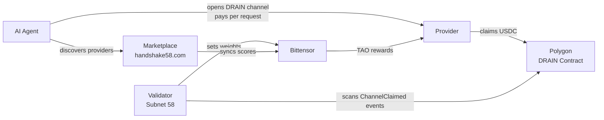
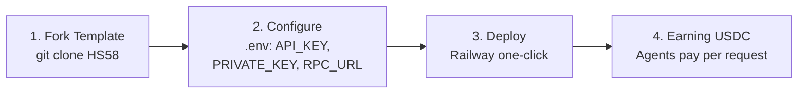

<p align="center">
  
</p>

<h1 align="center">Handshake58</h1>

<p align="center">
  <strong>AI Provider Directory powered by DRAIN Protocol & Bittensor Subnet 58</strong>
</p>

<p align="center">
  <a href="https://handshake58.com">Live Marketplace</a> ·
  <a href="docs/thesis.html">Thesis</a> ·
  <a href="https://github.com/kimbo128/DRAIN">DRAIN Protocol</a>
</p>

---

## What is Handshake58?

Handshake58 is a decentralized AI provider marketplace where agents discover providers, pay per request via the DRAIN Protocol, and providers are scored trustlessly through Bittensor Subnet 58.

- **Provider Discovery** — Find AI providers by model, tier, or score
- **Trustless Scoring** — Bittensor validators score providers based on real on-chain usage
- **Micropayments** — Pay-per-request with USDC on Polygon via payment channels
- **Two Provider Tiers** — Bittensor Miners (auto-verified) and Community Providers (admin-approved)
- **MCP Integration** — AI agents discover providers automatically

---

## How It Works



**For Agents:** Discover providers → Deposit USDC → Send requests with signed vouchers → Withdraw unused funds

**For Providers:** Deploy template → Register on marketplace → Serve AI inference → Auto-claim USDC earnings

---

## Provider Templates

Ready-to-deploy provider templates for popular AI backends:

| Template | Backend | Models |
|----------|---------|--------|
| [`hs58-openai`](providers/hs58-openai) | OpenAI | GPT-4o, o1, o3-mini, GPT-3.5 |
| [`hs58-claude`](providers/hs58-claude) | Anthropic | Claude 3.5 Sonnet, Haiku, Opus |
| [`hs58-grok`](providers/hs58-grok) | xAI | Grok-2, Grok-2 Mini |
| [`hs58-openrouter`](providers/hs58-openrouter) | OpenRouter | 200+ models |
| [`hs58-chutes`](providers/hs58-chutes) | Chutes | Bittensor inference models |
| [`hs58-custom`](providers/hs58-custom) | **Any** | Ollama, vLLM, Together, Fireworks, LiteLLM, etc. |

Each template includes:
- Full DRAIN voucher validation (EIP-712 signatures)
- Automatic payment claiming with expiry protection
- OpenAI-compatible API (`/v1/chat/completions`)
- Configurable pricing with upstream markup
- Pre-claim balance checks and error recovery
- Health monitoring endpoints
- One-click Railway deployment

---

## Quick Start — Deploy a Provider



> Works with: OpenAI, Anthropic, xAI, Ollama, vLLM, any OpenAI-compatible API

### Prerequisites

- **Node.js** >= 18 and npm
- **Polygon wallet** — You need a private key to receive USDC payments (see [Wallet Setup](#wallet-setup) below)
- **API key** for your chosen backend (e.g. OpenAI, Anthropic) — not needed for self-hosted like Ollama
- **Alchemy account** (free) — for reliable Polygon RPC ([sign up here](https://www.alchemy.com/))

### Step 1: Clone & Install

```bash
git clone https://github.com/Handshake58/HS58.git
cd HS58/providers/hs58-openai  # or hs58-claude, hs58-grok, hs58-custom, etc.

npm install
cp env.example .env
```

### Step 2: Configure .env

```bash
# Required
OPENAI_API_KEY=sk-...                 # Your backend API key
PROVIDER_PRIVATE_KEY=0x...            # Polygon wallet private key (receives USDC)

# Recommended — use Alchemy for reliable claiming (free tier is fine)
POLYGON_RPC_URL=https://polygon-mainnet.g.alchemy.com/v2/YOUR_KEY

# Optional (defaults shown)
PORT=3000
CHAIN_ID=137                          # 137=Polygon, 80002=Amoy testnet
CLAIM_THRESHOLD=1000000               # Min amount to claim (1 USDC)
MARKUP_PERCENT=50                     # Markup on upstream prices
PROVIDER_NAME=HS58-OpenAI             # Name in API responses
AUTO_CLAIM_INTERVAL_MINUTES=10        # How often to check for expiring channels
AUTO_CLAIM_BUFFER_SECONDS=3600        # Claim channels expiring within this window
```

### Step 3: Run locally or deploy

**Local:**
```bash
npm run dev
# Provider runs at http://localhost:3000
# Test: curl http://localhost:3000/health
```

**Railway (recommended for production):**
1. Fork this repo on GitHub
2. Go to [railway.app](https://railway.app) → New Project → Deploy from GitHub Repo
3. Select your fork, set **Root Directory** to `/providers/hs58-openai` (or your template)
4. Add environment variables in the **Variables** tab
5. Deploy — Railway auto-detects the `railway.json` and builds

### Step 4: Register on the Marketplace

Once your provider is running, visit [handshake58.com/become-provider](https://handshake58.com/become-provider) to submit your provider for listing. Bittensor miners are auto-verified; community providers need admin approval.

---

## Wallet Setup

### Polygon Wallet (for Providers)

You need a Polygon wallet to receive USDC payments. The private key goes into `PROVIDER_PRIVATE_KEY`.

**Option A: MetaMask (easiest)**
1. Install [MetaMask](https://metamask.io/)
2. Create a new account
3. Export the private key: Account Details → Export Private Key
4. Copy the `0x...` private key into your `.env`

**Option B: Command line**
```bash
# Using cast (from Foundry)
cast wallet new
# Output: Address: 0x... Private Key: 0x...

# Or using Node.js
node -e "const w = require('ethers').Wallet.createRandom(); console.log('Address:', w.address, '\nPrivate Key:', w.privateKey)"
```

> **Important:** Fund your wallet with a small amount of MATIC for gas (~$0.01 is enough). You can bridge from any chain or buy on an exchange.

### Bittensor Wallet (for Miners/Validators)

See the [HS58-subnet README](https://github.com/Handshake58/HS58-subnet) for Bittensor wallet setup with `btcli`.

---

## For Miners (Bittensor Subnet 58)

Run a provider + register as a Bittensor miner to earn TAO incentives.

### 10 Minute Setup

1. **Deploy a provider** — Pick a template above, deploy on Railway (see [Quick Start](#quick-start--deploy-a-provider))
2. **Install btcli** — `pip install bittensor` (Python >= 3.9)
3. **Create wallet** — `btcli wallet new_coldkey` + `btcli wallet new_hotkey`
4. **Fund with TAO** — Send ~0.1 TAO to your coldkey for registration
5. **Register** — `btcli subnet register --netuid 58`
6. **Deploy miner neuron** — Fork [HS58-subnet](https://github.com/Handshake58/HS58-subnet), set `NEURON_TYPE=miner`
7. **Done** — Miner auto-registers on handshake58.com, validator scores you

See the full guide in the [HS58-subnet README](https://github.com/Handshake58/HS58-subnet).

### Scoring

- **60% DRAIN Claims** — Real USDC claimed from payment channels (7-day rolling window)
- **40% Availability** — Provider responds to validator health checks with valid wallet proof

> **Score showing 0?** Run a [self-test payment](docs/score-keepalive.md) to generate on-chain claims and bootstrap your score (~$0.13/test).

### TAO Rewards

| Recipient | Share |
|-----------|-------|
| Miners | 41% |
| Validators | 41% |
| Subnet Owner | 18% |

Hardcoded in Yuma Consensus — not configurable.

---

## For Validators

Run a validator to score providers on Subnet 58.

1. **Install btcli** — `pip install bittensor`
2. **Create wallet + stake TAO** — Need enough stake for weight-setting permission
3. Fork [HS58-subnet](https://github.com/Handshake58/HS58-subnet), set `NEURON_TYPE=validator`
4. Deploy on Railway as worker service
5. See the [HS58-subnet README](https://github.com/Handshake58/HS58-subnet) for full setup

---

## For AI Agents

### MCP Server

```bash
npm install -g drain-mcp
```

```json
{
  "mcpServers": {
    "drain": {
      "command": "drain-mcp",
      "env": {
        "DRAIN_PRIVATE_KEY": "your-polygon-wallet-private-key"
      }
    }
  }
}
```

The MCP server provides 9 tools: `drain_providers`, `drain_provider_info`, `drain_balance`, `drain_approve`, `drain_open_channel`, `drain_chat`, `drain_channel_status`, `drain_channels`, `drain_close_channel`.

**Provider categories:** `llm`, `image`, `audio`, `code`, `scraping`, `vpn`, `multi-modal`, `other`. For non-LLM providers, read docs via `drain_provider_info` before sending requests.

### API Discovery

```bash
# All providers
GET https://handshake58.com/api/mcp/providers

# Filter by category or model
GET https://handshake58.com/api/mcp/providers?model=gpt-4o&category=scraping&limit=3&format=compact
```

**Filters:** `model`, `category`, `tier` (bittensor/community), `minScore`, `limit`, `format` (compact/full)

### Agent Documentation

- [Full Protocol Docs (SKILL.md)](https://handshake58.com/skill.md)
- [Quick Reference (llms.txt)](https://handshake58.com/llms.txt)
- [MCP Skill File (drain-mcp)](drain-mcp/SKILL.md)

---

## Contract Addresses

| Contract | Address | Network |
|----------|---------|---------|
| DRAIN Channel | `0x1C1918C99b6DcE977392E4131C91654d8aB71e64` | Polygon Mainnet |
| USDC | `0x3c499c542cEF5E3811e1192ce70d8cC03d5c3359` | Polygon Mainnet |

[View on Polygonscan](https://polygonscan.com/address/0x1C1918C99b6DcE977392E4131C91654d8aB71e64)

---

## Repositories

| Repo | Description |
|------|-------------|
| **[HS58](https://github.com/Handshake58/HS58)** | This repo — provider templates, docs, hub |
| [HS58-subnet](https://github.com/Handshake58/HS58-subnet) | Bittensor Subnet 58 validator + miner |
| [DRAIN Protocol](https://github.com/kimbo128/DRAIN) | Core protocol, smart contracts, SDK |

---

## Pricing

- **Protocol fee:** 0% on payments
- **Gas cost:** ~$0.02 per channel open/claim on Polygon
- **Provider markup:** Set by each provider (typically 20-50% on upstream costs)

---

## License

[PolyForm Shield 1.0](https://polyformproject.org/licenses/shield/1.0.0/) — You can use, modify, and deploy this software for any purpose **except** building a competing product. See [LICENSE](LICENSE) for details.

---

Handshake58 &copy; 2026 — Trustless AI payments powered by DRAIN Protocol & Bittensor
